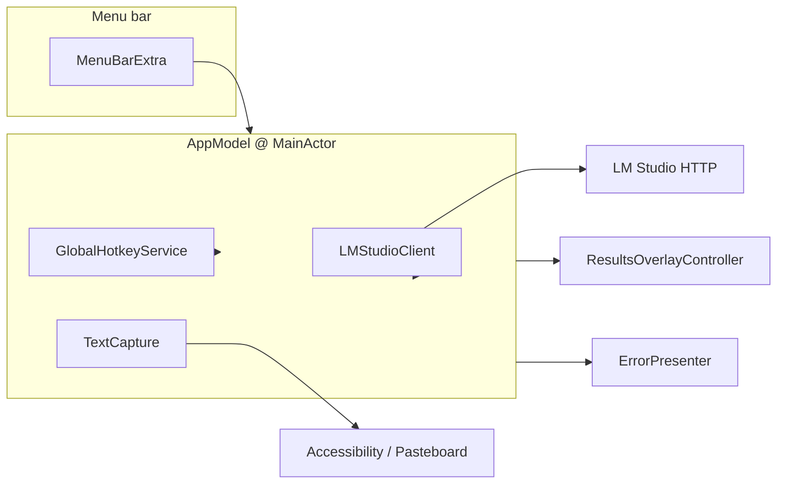

# Architecture

FixMyGrammar is a small **SwiftPM** package with an **executable** target and a **library** target.

## Flow

1. **Trigger**: User presses the configured global shortcut or chooses **Check grammar** from the menu. `AppModel.performCheck()` runs (async).
2. **Capture**: `TextCapture` reads text per **Settings** (clipboard order, selection-only, etc.). Optional **Accessibility** permission is required for selection in many apps.
3. **Truncate**: `InputContextLimiter` shortens user text to fit an approximate token budget (settings + optional server-reported context from `GET /v1/models`).
4. **Request**: `LMStudioClient` POSTs to `/v1/chat/completions` with `GrammarPrompt.systemMessage` (from **FixMyGrammarCore**) and the user text.
5. **Parse**: Response body is parsed with `GrammarJSONParser` into `GrammarReviewPayload` (JSON only; markdown fences are stripped).
6. **Present**: On success, `activeResult` is set; `ResultsOverlayController` shows a floating overlay. On failure, `ErrorPresenter` may show an alert; quiet failures store `lastError` for the **Show last error** menu item.

## Targets

| Target              | Role |
|---------------------|------|
| `FixMyGrammarCore`  | `GrammarReviewPayload`, `GrammarJSONParser`, `GrammarPrompt` — no AppKit. |
| `FixMyGrammar`      | `@main` SwiftUI app, menu bar extra, windows, hotkey (HotKey dependency). |
| `FixMyGrammarTests` | Unit tests for the core parser. |

## Privacy (local-first)

By default, text is sent only to the **base URL you configure** (typical: localhost LM Studio). The app does not ship analytics. Clipboard and Accessibility access are used solely to obtain the text you ask to check.
